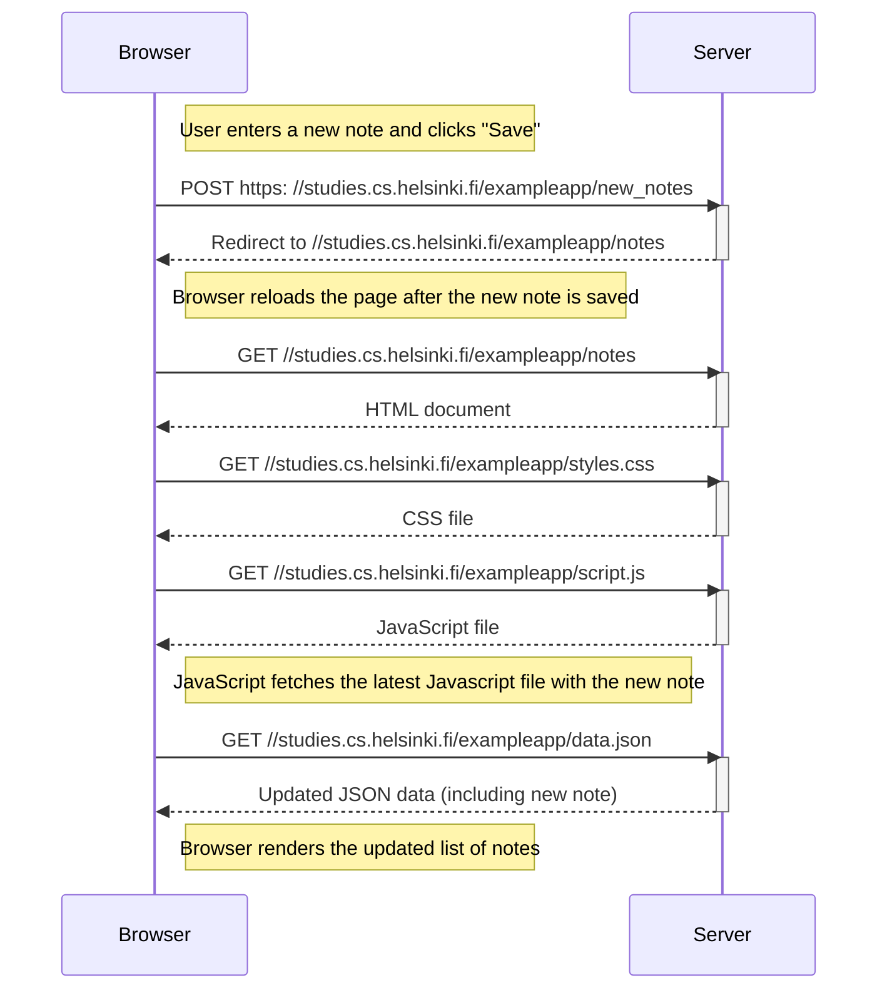

```mermaid
sequenceDiagram
    participant Browser
    participant Server

    Note right of Browser: User enters a new note and clicks "Save"

    Browser->>Server: POST https: //studies.cs.helsinki.fi/exampleapp/new_notes
    activate Server
    Server-->>Browser: Redirect to //studies.cs.helsinki.fi/exampleapp/notes
    deactivate Server

    Note right of Browser: Browser reloads the page after the new note is saved

    Browser->>Server: GET //studies.cs.helsinki.fi/exampleapp/notes
    activate Server
    Server-->>Browser: HTML document
    deactivate Server

    Browser->>Server: GET //studies.cs.helsinki.fi/exampleapp/styles.css
    activate Server
    Server-->>Browser: CSS file
    deactivate Server

    Browser->>Server: GET //studies.cs.helsinki.fi/exampleapp/script.js
    activate Server
    Server-->>Browser: JavaScript file
    deactivate Server

    Note right of Browser: JavaScript fetches the latest Javascript file with the new note

    Browser->>Server: GET //studies.cs.helsinki.fi/exampleapp/data.json
    activate Server
    Server-->>Browser: Updated JSON data (including new note)
    deactivate Server

    Note right of Browser: Browser renders the updated list of notes

```
