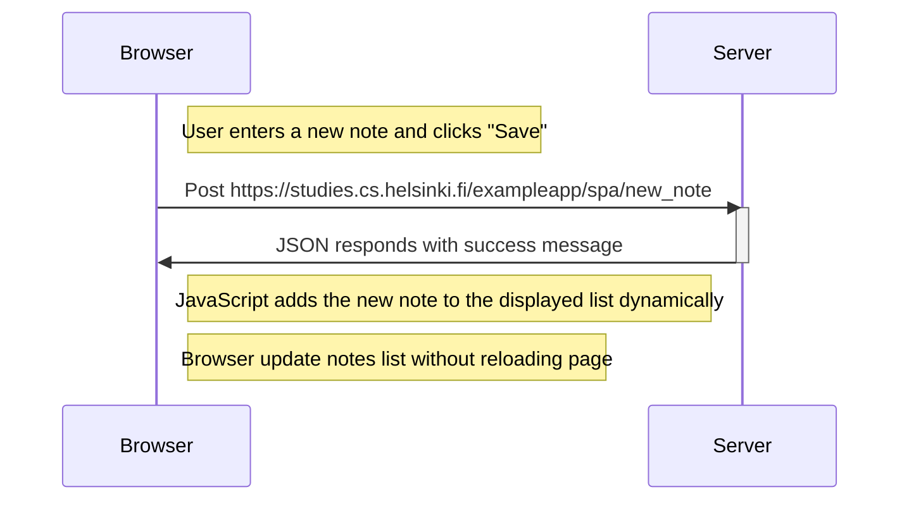

```mermaid
sequenceDiagram

participant Browser
participant Server

 Note right of Browser: User enters a new note and clicks "Save"

 Browser->>Server: Post https://studies.cs.helsinki.fi/exampleapp/spa/new_note
 activate Server
 Server->>Browser: JSON responds with success message
 deactivate Server

  Note right of Browser: JavaScript adds the new note to the displayed list dynamically

  Note right of Browser: Browser update notes list without reloading page


```
