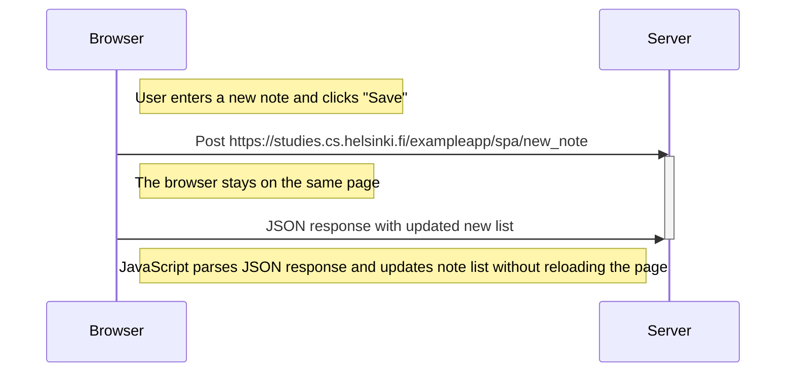

```mermaid
sequenceDiagram

participant Browser
participant Server

 Note right of Browser: User enters a new note and clicks "Save"

 Browser->>Server: Post https://studies.cs.helsinki.fi/exampleapp/spa/new_note
 activate Server

  Note right of Browser :The browser stays on the same page
 Browser->>Server: JSON response with updated new list
 deactivate Server

  Note right of Browser: JavaScript parses JSON response and updates note list without reloading the page


```
