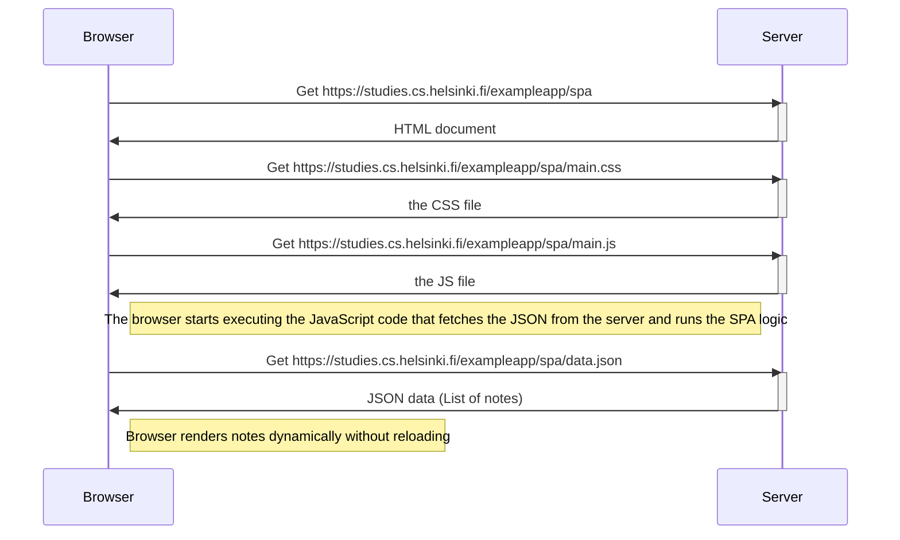

```mermaid
sequenceDiagram
participant Browser
participant Server

Browser->>Server: Get https://studies.cs.helsinki.fi/exampleapp/spa
    activate Server
    Server->>Browser:  HTML document
deactivate Server

Browser->>Server: Get https://studies.cs.helsinki.fi/exampleapp/spa/main.css
    activate Server
    Server->>Browser: the CSS file
deactivate Server

Browser->>Server: Get https://studies.cs.helsinki.fi/exampleapp/spa/main.js
    activate Server
    Server->>Browser: the JS file
deactivate Server

Note right of Browser: The browser starts executing the JavaScript code that fetches the JSON from the server and runs the SPA logic

Browser->>Server: Get https://studies.cs.helsinki.fi/exampleapp/spa/data.json
    activate Server
    Server->>Browser: JSON data (List of notes)
deactivate Server

    Note right of Browser: Browser renders notes dynamically without reloading

```
